# 🌟 Meteora Trading Bot

**💎 Support this project with SOLANA donations: `37niDgM4imp3XfrYNgcc9siJYCoJzXgSeqEdybZ7vUm3`**

A sophisticated, automated RSI-based trading bot for Solana that utilizes Meteora DLMM (Dynamic Liquidity Market Maker) pools for intelligent SOL/USDC trading.


## ✨ Features

- 🎯 **Intelligent RSI Strategy**: Multi-timeframe RSI analysis with adaptive thresholds
- 💰 **Liquidity Harvesting**: Smart bin-level liquidity extraction for maximum profits
- 🔄 **One-Sided Liquidity**: Optimized Meteora DLMM integration for directional trades
- 📊 **Real-time Dashboard**: Live monitoring with charts and performance metrics
- 🛡️ **Advanced Risk Management**: Automatic position management with stop-loss mechanisms
- 🔌 **Jupiter DEX Integration**: Seamless token swaps via Jupiter aggregator
- 🔐 **Enterprise Security**: BIP39 wallet security with hardware wallet support

## 🏗️ Architecture & System Overview


## 🧠 Trading Strategy: Liquidity Harvesting

The revolutionary Meteora trading strategy combines RSI-based signals with intelligent liquidity management:

```mermaid
flowchart TD
    A[Market Data Collection] --> B[RSI Calculation]
    B --> C{RSI Signal?}
    
    C -->|RSI < 30 Oversold| D[BUY Position Creation]
    C -->|RSI > 70 Overbought| E[SELL Position Creation]
    C -->|30-70 Neutral| F[Check Existing Positions]
    
    D --> G[SOL → USDC Liquidity]
    E --> H[USDC → SOL Liquidity]
    
    G --> I[Position Monitoring]
    H --> I
    F --> I
    
    I --> J{Price Movement?}
    
    J -->|Profit Zone| K[HARVEST: Already Traded Bins]
    J -->|Loss Signal| L[CLOSE: Complete Position]
    J -->|Neutral| M[HOLD: Collect Fees]
    
    K --> N[Adjust Position Range]
    N --> I
    L --> O[Wait for New Signal]
    M --> I
    O --> A
    
    style A fill:#e3f2fd
    style K fill:#e8f5e8
    style L fill:#ffebee
    style G fill:#f3e5f5
    style H fill:#fff3e0
```



### 💡 How the Strategy Generates Profit:

#### 1. **Directional Liquidity (One-Sided)**
- **BUY Signal**: Provide only SOL and exchange to USDC → More USDC from price increases after RSI oversold
Buy Example:


- **SELL Signal**: Provide only USDC and exchange to SOL → More SOL from price decrease after RSI overbought
Sell Example:


#### 2. **Intelligent Harvesting**


#### 3. **Dual-Exit Strategy**
- **Immediate Exit**: Price breaks through all bins → Close complete position
- **Signal Exit**: RSI reversal → Strategic position closure

## 📋 Prerequisites

- 🟢 Node.js >= 18.0.0
- 🟢 Yarn >= 1.22.0  
- 🟢 Solana Wallet (Phantom-compatible recovery phrase)
- 🟢 Helius RPC API Key
- 🟠 Binance API Key (optional for extended data)

## 🚀 Quick Start Guide

### 🔧 Development Setup
```bash
# 1. Fork & Clone
git clone https://github.com/SoldevBot/meteora-rsi-trading-bot.git
cd meteora-trading-bot

# 2. Install Dependencies  
yarn install --check-files

# 3. Setup Environment
cp packages/backend/.env.example packages/backend/.env
cp packages/frontend/.env.example packages/frontend/.env

# 4. Start Development
yarn dev
```

### 2️⃣ Environment Configuration


**Backend Configuration** (`packages/backend/.env`):
```env
# 🔗 Solana Network
HELIUS_API_KEY=your_helius_api_key_here
SOLANA_RPC_URL=https://mainnet.helius-rpc.com/?api-key=your_key

# 📊 Market Data (optional)
BINANCE_API_KEY=your_binance_api_key
BINANCE_SECRET_KEY=your_binance_secret

# 🔐 Wallet (⚠️ TESTNET ONLY!)
WALLET_SEED_PHRASE=your_twelve_word_seed_phrase_from_phantom_here

# 🎯 Trading Configuration
RSI_OVERSOLD_THRESHOLD=30
RSI_OVERBOUGHT_THRESHOLD=70
DEFAULT_CHECK_INTERVAL=60000

# 💰 Position Factors (% of wallet balance)
POSITION_FACTOR_1M=0.05    # 5% for 1-minute timeframe
POSITION_FACTOR_15M=0.07   # 7% for 15-minute timeframe
POSITION_FACTOR_1H=0.1     # 10% for 1-hour timeframe
POSITION_FACTOR_4H=0.12    # 12% for 4-hour timeframe
POSITION_FACTOR_1D=0.15    # 15% for 1-day timeframe

# 🏊 Trading Pair Configuration
TRADING_SYMBOL=SOLUSDT     # Binance symbol for price/RSI data
BASE_TOKEN_MINT=So11111111111111111111111111111111111111112   # SOL mint
QUOTE_TOKEN_MINT=EPjFWdd5AufqSSqeM2qN1xzybapC8G4wEGGkZwyTDt1v # USDC mint
BASE_TOKEN_SYMBOL=SOL      # For logging and UI
QUOTE_TOKEN_SYMBOL=USDC    # For logging and UI

# 🌊 DLMM Pool Configuration per Timeframe
POOL_ID_1M=5rCf1DM8LjKTw4YqhnoLcngyZYeNnQqztScTogYHAS6
POOL_ID_15M=BGm1tav58oGcsQJehL9WXBFXF7D27vZsKefj4xJKD5Y
POOL_ID_1H=BVRbyLjjfSBcoyiYFuxbgKYnWuiFaF9CSXEa5vdSZ9Hh
POOL_ID_4H=5XRqv7LCoC5FhWKk5JN8n4kCrJs3e4KH1XsYzKeMd5Nt
POOL_ID_1D=CgqwPLSFfht89pF5RSKGUUMFj5zRxoUt4861w2SkXaqY

# 📏 Pool Bin Steps per Timeframe
BIN_STEP_1M=4              # Fine granularity for scalping
BIN_STEP_15M=10            # Medium granularity for day trading
BIN_STEP_1H=20             # Standard granularity for swing trading
BIN_STEP_4H=50             # Wider steps for position trading
BIN_STEP_1D=80             # Widest steps for trend following

# 💸 Pool Base Fees per Timeframe
BASE_FEE_1M=0.001          # 0.1% fee for high frequency
BASE_FEE_15M=0.001         # 0.1% fee for medium frequency
BASE_FEE_1H=0.002          # 0.2% fee for standard trading
BASE_FEE_4H=0.005          # 0.5% fee for position trading
BASE_FEE_1D=0.0005         # 0.05% fee for long-term trading

# 🎯 Trading Strategy Configuration
TRADING_STRATEGY=BidAsk    # BidAsk, Curve, Spot
STRATEGY_TYPE_1M=BidAsk    # Individual strategy per timeframe
STRATEGY_TYPE_15M=BidAsk
STRATEGY_TYPE_1H=BidAsk
STRATEGY_TYPE_4H=BidAsk
STRATEGY_TYPE_1D=BidAsk

# 🌾 Liquidity Harvesting Configuration
HARVEST_ENABLED=true       # Enable intelligent bin harvesting
HARVEST_MIN_BINS=2         # Minimum bins to harvest
HARVEST_MIN_PRICE_MOVE=0.01 # Minimum 1% price move to harvest
HARVEST_BPS_THRESHOLD=100  # Harvest when 1% of bins are profitable

# ⚡ Transaction Configuration
TRANSACTION_TIMEOUT=180000       # 3 minutes timeout for transactions
TRANSACTION_MAX_RETRIES=5        # Maximum transaction retries
TRANSACTION_SKIP_PREFLIGHT=false # Skip preflight checks (faster but less safe)
TRANSACTION_MAX_RECENT_BLOCKHASH_AGE=60 # Max age for recent blockhash (seconds)

# 🌐 Server
PORT=3001
NODE_ENV=development
```

**Frontend Configuration** (`packages/frontend/.env`):
```env
REACT_APP_BACKEND_URL=http://localhost:3001
REACT_APP_ENVIRONMENT=development
```

### 3️⃣ Getting Started

```bash
# 🚀 Development mode (recommended)
yarn dev

# 🔧 Start individually
yarn start:backend  # Backend: http://localhost:3001
yarn start:frontend # Frontend: http://localhost:3000

# 🎯 Production
yarn build && yarn start
```

## 🎯 Meteora Pool Configuration

Different DLMM pools for various timeframes and risk profiles:


| Timeframe | Pool ID | Bin Step | Position Factor | Base Fee | Strategy |
|-----------|---------|----------|----------------|----------|----------|
| **1min** | `5rCf1DM8LjK...` | 4 | 5% | 0.1% | BidAsk/Curve/Spot | 
| **15min** | `BGm1tav58oG...` | 10 | 7% | 0.1% | BidAsk/Curve/Spot | 
| **1h** | `BVRbyLjjfSB...` | 20 | 10% | 0.2% | BidAsk/Curve/Spot | 
| **4h** | `5XRqv7LCoC5...` | 50 | 12% | 0.5% | BidAsk/Curve/Spot | 
| **1d** | `CgqwPLSFfht...` | 80 | 15% | 0.05% | BidAsk/Curve/Spot | 

### 🎛️ Advanced Configuration Options

#### Liquidity Harvesting Settings
- **HARVEST_ENABLED**: Enable/disable intelligent bin harvesting
- **HARVEST_MIN_BINS**: Minimum number of bins required to trigger harvest
- **HARVEST_MIN_PRICE_MOVE**: Minimum price movement (1%) to consider harvesting
- **HARVEST_BPS_THRESHOLD**: Harvest threshold in basis points (100 = 1%)

#### Transaction Optimization
- **TRANSACTION_TIMEOUT**: 3-minute timeout for blockchain transactions
- **TRANSACTION_MAX_RETRIES**: Maximum of 5 retry attempts for failed transactions
- **TRANSACTION_SKIP_PREFLIGHT**: Skip preflight checks for faster execution (less safe)
- **TRANSACTION_MAX_RECENT_BLOCKHASH_AGE**: 60-second maximum age for blockhash

## 🔒 Security Concept


### ⚠️ CRITICAL SECURITY NOTES

🚨 **NEVER store real wallet seeds in .env files!**

✅ **Recommended Setup:**
- **Development**: Separate test wallet with minimal funds
- **Production**: Hardware wallet or secure key management systems
- **API Keys**: Environment variables with restricted permissions

## 📊 Trading Dashboard


### Dashboard Features:
- 📈 **Live RSI Charts**: Multi-timeframe RSI visualization with overbought/oversold zones
- 📋 **Position Management**: Real-time tracking of all active positions
- 💰 **Balance Monitoring**: SOL/USDC balance with historical trends
- ⚡ **Quick Actions**: Fast position creation and Jupiter swaps

## 🔄 Automated Trading Workflow


## 📡 API Reference

### Backend Endpoints (Port 3001)


#### 💰 Wallet Management
```http
GET /api/wallet/balance          # Current SOL/USDC balance
GET /api/health                  # Service health check
```

#### 📊 Position Management
```http
GET /api/positions               # All active positions
POST /api/positions              # Create new position
PUT /api/positions/:id           # Update position
DELETE /api/positions/:id        # Close position
```

#### 📈 Market Data
```http
GET /api/rsi/:timeframe          # RSI for specific timeframe
GET /api/rsi                     # RSI for all timeframes
GET /api/price                   # Current SOL/USDC price
```

#### ⚙️ Configuration
```http
GET /api/config                  # Get trading configuration
PUT /api/config                  # Update trading configuration
```

#### 🔄 Jupiter Integration
```http
GET /api/tokens                  # Supported tokens
POST /api/swap/quote             # Request swap quote
POST /api/swap/execute           # Execute swap
```

## 🏗️ Project Structure

```
meteora-trading-bot/
├── 📦 packages/
│   ├── 🔧 backend/              # Node.js API & Trading Logic
│   │   ├── src/
│   │   │   ├── controllers/     # HTTP Request Handlers
│   │   │   ├── services/        # Business Logic
│   │   │   │   ├── tradingService.ts    # Meteora DLMM Integration
│   │   │   │   ├── dataService.ts       # RSI & Market Data
│   │   │   │   └── schedulerService.ts  # Automated Trading
│   │   │   ├── middleware/      # Express Middleware
│   │   │   ├── routes/          # API Route Definitions
│   │   │   ├── utils/           # Logger & Utilities
│   │   │   └── app.ts           # Express Application
│   │   ├── tests/               # Unit & Integration Tests
│   │   ├── data/                # Position Persistence
│   │   └── logs/                # Application Logs
│   ├── 🖥️ frontend/             # React Dashboard
│   │   ├── src/
│   │   │   ├── components/      # Reusable UI Components
│   │   │   ├── pages/           # Page Components
│   │   │   ├── hooks/           # Custom React Hooks
│   │   │   ├── services/        # API Client
│   │   │   └── App.tsx          # Main Application
│   │   └── package.json
│   └── 🔗 shared/               # Shared Types & Utils
│       ├── src/
│       │   ├── types.ts         # TypeScript Interfaces
│       │   └── index.ts         # Exports
│       └── package.json
├── 📄 package.json              # Root Workspace Config
├── 🚀 start.sh                  # Production Start Script
└── 📖 README.md
```

## 💡 Trading Strategies in Detail

### 🎯 RSI Strategy Configuration


### 🔄 Enhanced Liquidity Harvesting Mechanism
```

### 🔄 Enhanced Liquidity Harvesting Mechanism

The bot now features an intelligent harvesting system with configurable parameters for optimal profit extraction:

#### 🎯 Smart Harvesting Logic


#### 📋 Configuration Parameters
- **HARVEST_ENABLED**: Master switch for harvesting functionality
- **HARVEST_MIN_BINS**: Minimum 2 bins required before harvesting
- **HARVEST_MIN_PRICE_MOVE**: 1% minimum price movement threshold
- **HARVEST_BPS_THRESHOLD**: 100 BPS (1%) profitability threshold

**BUY Position Example:**
1. **Initial**: Position from $180 - $185 with USDC liquidity
2. **Price rises to $182**: Smart check: movement > 1% ✓, bins profitable > 1% ✓
3. **HARVEST**: Extract liquidity from bins $180-$182
4. **New Range**: $182 - $185 (position remains active for continued fees)
5. **Profit**: Harvested tokens + ongoing fee collection

**SELL Position Example:**
1. **Initial**: Position from $180 - $185 with SOL liquidity  
2. **Price falls to $183**: Smart check: movement > 1% ✓, bins profitable > 1% ✓
3. **HARVEST**: Extract liquidity from bins $183-$185
4. **New Range**: $180 - $183 (position remains active for continued fees)
5. **Profit**: Harvested tokens + ongoing fee collection

#### 🛡️ Risk Management Integration
- **Buffer Zones**: Positions close at 95% of range boundary for immediate risk
- **Strategic Exits**: RSI signal-based exits at 85% range penetration
- **Range Limits**: Maximum 10% price range per position to control exposure

## 🛠️ Technologies Used

### Backend Stack


- **🟢 Node.js + TypeScript**: Runtime & type safety
- **🚀 Express.js**: RESTful API framework
- **⛓️ @solana/web3.js**: Solana blockchain integration
- **🌊 @meteora-ag/dlmm-sdk**: Meteora DLMM protocol
- **📊 technicalindicators**: RSI & TA calculations
- **🔗 axios**: HTTP client for external APIs
- **⏰ node-cron**: Automated tasks
- **📝 winston**: Structured logging

### Frontend Stack


- **⚛️ React + TypeScript**: UI framework & type safety
- **🎨 Material-UI**: Modern UI components
- **📈 Chart.js**: Interactive data visualization
- **🔄 React Query**: State management & caching
- **⚡ Vite**: Build tool & dev server

## 🚀 Production Deployment

### 🐳 Docker Setup (Planned)
```dockerfile
# Multi-stage build for optimal performance
FROM node:18-alpine AS builder
WORKDIR /app
COPY . .
RUN yarn install --frozen-lockfile
RUN yarn build

FROM node:18-alpine AS production
WORKDIR /app
COPY --from=builder /app/dist ./dist
COPY --from=builder /app/node_modules ./node_modules
EXPOSE 3001
CMD ["node", "dist/app.js"]
```

### 🔧 Environment Setup
```bash
# Production Environment
NODE_ENV=production
LOG_LEVEL=info
RATE_LIMIT_ENABLED=true
MONITORING_ENABLED=true
```

## ⚖️ Legal Notice

> **Disclaimer**: This tool is exclusively for educational and research purposes. 
> Trading with cryptocurrencies involves significant financial risks. 
> The user bears full responsibility for all trading decisions and possible losses.
> 
> The developers assume no liability for financial losses or damages.

## 📞 Support & Community

🐛 **Bugs & Issues**: [GitHub Issues](https://github.com/SoldevBot/meteora-rsi-trading-bot/issues)
💬 **Discussions**: [GitHub Discussions](https://github.com/SoldevBot/meteora-rsi-trading-bot/discussions)
📧 **Contact**: [Email Support](mailto:soldev_bot@proton.me)

---

**🌟 Developed with ❤️ for the Solana Community**
